# All about Big Data 

    Tools: 
    Python
    Java
    Apache Hadoop
    Apache Hadoop HDFS
    Apache Hadoop YARN
    Apache Spark
    Apache Hadoop MapReduce
    Spark Streaming
    Apache Kafka
    SQL

## How to learn:
- https://www.youtube.com/watch?v=DCaiZq3aBSc Hadoop
- https://cognitiveclass.ai/learn/big-data Big data, Hadoop, Spark 
- https://www.mygreatlearning.com/academy/courses/2618180/10977#?utm_source=share_with_friends Also interesting 21 hours of video
- https://www.javatpoint.com/hadoop-tutorial or https://www.tutorialspoint.com/big_data_tutorials.htm tutorials about Hadoop (Hive, HDFS, MapReduce, YARN), Spark, Kafka
- https://learn.datacamp.com/skill-tracks/big-data-with-pyspark PySpark
- https://www.coursera.org/learn/big-data-essentials HDFS, MapReduce and Spark RDD 

## World of Hadoop
1. Query engine
2. Core Hadoop ecosystem
3. Enternal Data Storage
    - MySQL, MongoDB, Cassandra

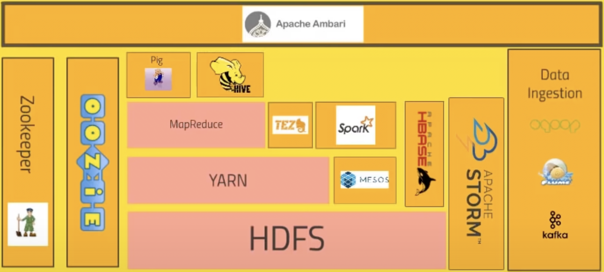
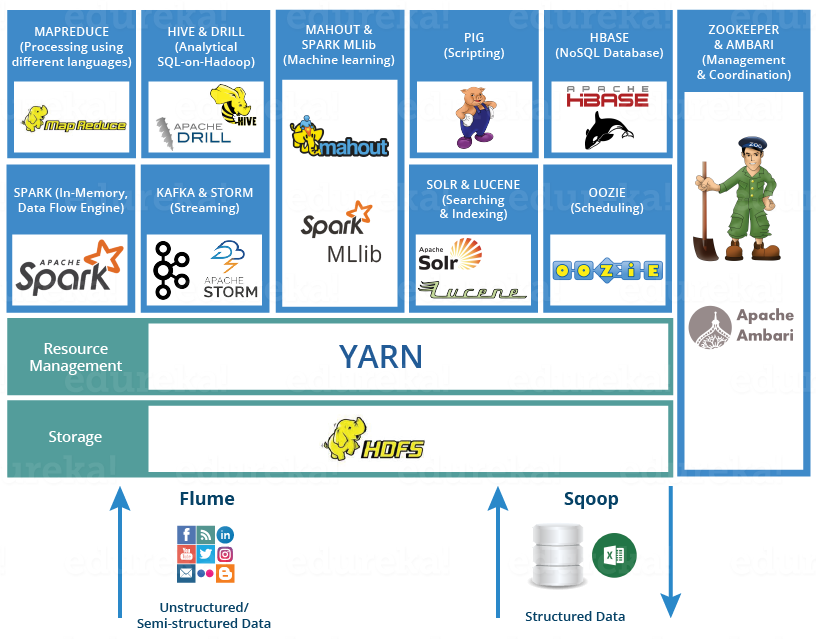

### **Core Hadoop ecosystem**
- **HDFS** = Hadoop distributes file system, data storage (distributed) part of Hadoop.
- **Hadoop YARN** = Yet another resource negotiator, YARN is a resource allocator which allocates resources to run your jobs. Manages the resources on the computing cluster, knows what nodes are available, heartbeat which keeps the cluster going. YARN in a nut shell has a master (Resource Manager = job tracker) and workers (Node manager = task tracker).
- **Hadoop MapReduce**, programming model which allows us to process the data across the cluster. *Maps* transform the data in parallel across the cluster, *reducers* aggregate the data together.
- **Apache Pig** - no need to write Python, Java code, high level API with SQL-like syntasis.
- **Apache Hive** - Apache Hive is a data warehouse software project built on top of Apache Hadoop for providing data query and analysis. Hive gives an SQL-like interface to query data stored in various databases and file systems that integrate with Hadoop. Used mostly to make an analysis or report. 
- **Ambari** - sits on top of everything, tell info about cluster, and visualize a cluster, how much resources I am using. Apache Ambari simplifies the management and monitoring of an Apache Hadoop cluster. 
- **Apache Spark** - alternative of MapReduce, very fast and effective, can handle SQL queries, handle streaming the data. Spark's data processing speeds are up to 100x faster than MapReduce. Because Spark processes and retains data in memory for subsequent steps.
- **Apache HBase** - Apache HBase is a NoSQL key/value store which runs on top of HDFS.
- **Apache Storm** - working with the (streamed) data on real time (not a batch), data may come from sensors maybe.
- **OOZIE** - workflow scheduling system to manage Hadoop jobs. It is like a CRON or AirFlow. Oozie submit the job to yarn and yarn executes the job. Yarn give and manage resources to run those jobs and it does that for not only oozie jobs but many other things. 
- **Sqoop** - data ingestion from external resources to HDFS for example. A connector between Hadoop and legacy data systems.
- **Flume** - web logs to cluster in real time for processing.
- **Apache Kafka** - collect data from cluster of pcs, web services and broadcast that to Hadoop cluster. Solves the problem of data ingestion.
- https://www.ibm.com/cloud/blog/hadoop-vs-spark
- **Apache ZooKeeper** coordinates with various services in a distributed environment. ... Apache Oozie is a scheduler which schedules Hadoop jobs and binds them together as one logical work.

# [Mastering Big Data Analytics](https://olympus.greatlearning.in/courses/10977/pages/big-data-touch) by Great Learning

- Hadoop: Master your Big Data
- Hive: Big data SQL
- Spark: Stream and analyze the big data
- Apache Kafka: Distributed Streaming Platform
- Advanced Spark

## Hadoop: Master your Big Data
### Big data touch
- **Big data** a massive volume of both structured and unstructured data which is very large and complex to process using traditional database and software techniques.
- Semi-structured and unstructured data can be:
    - Human generated data: blogs, reviews, emails, pictures, (facebook, linkedin, twitter)
    - Machine generated data: Internet clickstream records, web server logs, IoT sensor data, images / video (video surveillance, satellite images)
- Why big data become popular?
    - 90% of all data created just in the last 2 years.
    - 80% of data is unstructured, so difficult to analyze.
    - Limitation in processing of in handling large structured data.
- Cases for BD:
    - Financial services:
        - Detect froud
        - Model and manage risk
        - Improve dept recovery rates
        - Personalize banking / insurance products
    - Ratail
        - In-store behavior analysis
        - Cross selling
        - Optimize pricing, placement, design
    - Social media
        - Location based marketing
        - Social segmentation
        - Sentiment analysis
        - Price comparison services
    - And many ...

### Getting started: Hadoop
- **What is the Hadoop?** Apache Hadoop is a collection of open-source software utilities that facilitates using a network of many computers to solve problems involving massive amounts of data and computation. It provides a software framework for distributed storage and processing of big data using the MapReduce programming model.

### Hadoop framework: Stepping into Hadoop
- Hadoop 1.0
    - Name node, secondary name node
    - Job tracker, task tracker
    - Data nodes

**Key words (for Hadoop)**
- Commodity hardware: PCs that can be used to make a cluster
- Cluster / grid: Interconnection of systems in a network.
- Node: A single instance of a computer
- Distributed systems: A system composed to multiple autonomous computers that communicate through a computer network.
- ASF = Apache Software Foundation
- HA: high availability
- Hot standby: uninterrupted failover. Hot standby is normally available to the users within minutes of a disaster situation.

**Master-Slave Architecture**
- Machines in a master mode:
    - Name node, secondary name node, job tracker
- Slave nodes never transmit data without receiving a request from the master node, they wait for the signal from master. 
    - Data nodes
- Moreover, they are not connected via wifi, but via cables (optical). Together they make the cluster. 

**Deployment nodes**
- *Fully distributed mode*: each service runs on a seperate hardware. Used in production. Service means (namenode, secondary namenode, job tracker, and data node).
- *Pseudo distributed mode*: All services run on the same machine but with a different JVM (testing)
- *Standalone mode*: All services run on the same machine and on the one JVM. 

**Functionality of each component**
- Master node
    - Namenode = central file system manager, the centralpice of HDFS
    - Secondary namenode = data backup of name node (not a hot standby), kind of checkpoint.
    - Job tracker: Centralized job scheduler
- Slave nodes
    - Data nodes: machines where the data gets stored and processed. All big data processing happens on the data node.
    - Task tracker: track the activiteies happing on the data node, and report it to job tracker. Each data node has its task tracker.
- Note: Every slave node keeps sending a heart beat signal to the name node once every 3 seconds to state that they are alive. What happens is when the data node goes down?

**NOTES**
- [Are Secondary NameNode and Standby node mean the same thing?](https://community.cloudera.com/t5/Support-Questions/Are-Secondary-NameNode-and-Standby-node-mean-the-same-thing/td-p/221582)
There are two different concepts. HDFS can be deployed in two modes. 1) Without HA 2) With HA.
In without HA mode, HDFS will have Namenode and Secondary Namenode. Here, secondary namenode periodically take snapshot of namenode and keep the metadata (fsimage) and audit logs up to date. So in case of Namenode failure, Secondary Namenode will have copy of latest namenode activity and prevent data loss. 
In HA mode, HDFS have two set of Namenodes. One acts as active namenode and another acts as Standby Namenode. The duties of standby namenode is similar to Secondary namenode where it keeps the track of active namenode activity and take snapshot periodically. Here, in case of active namenode failure, standby namenode automatically takes the control and becomes active. This way user will not notice the failure in namenode. This way High availability is guaranteed.
- Secondary NameNode is not required in HA configuration because the Standby node also performs the tasks of the Secondary NameNode


**What is the job in Hadoop eco system?**
- A job is a *task* submitted to the cluster by the user
- A job is the form of a program or collection of programs (JAR files) which need to be executed.
- A job would have the following properties:
    - The actual program
    - Input data (collection of files)
    - Output directory

**Core software of Apache Hadoop**
- **HDFS** - data storage
- **MapReduce Framework** - once you have files, you need to process the data (parallel processing framework). 

**Submitting and executing the job in a hadoop cluster**
Hadoop cluster is the 3 masters (namenode, secondary namenode, job tracker)
<br>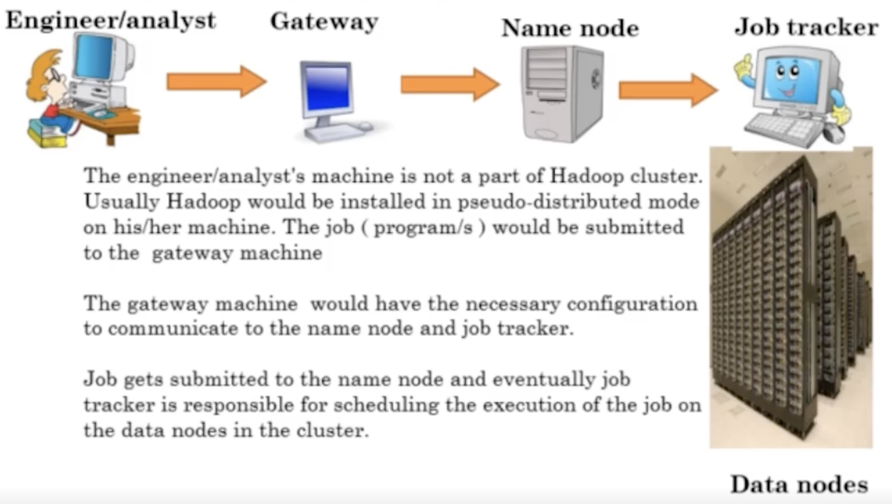

### HDFS
- If you have 1GB file, and when you want to push a file to Hadoop system it will be splitted by 64MB to each block (data nodes). You have one name node, and N data nodes. 
- Name node will remember what are the host names of the data nodes, it know where the part of data is saved. 
- Breaking up of the original file happens on the client machine not in the name node.
- **What if the data node fails?** Will you lose the part of your data saved on this node? So, the data is duplicated **3** times by *Replication factor*. Yes, if you have 1PB of data, Hadoop makes in **3PB**. If the data node do not send signal to name node. Hadoop decides that the node is crushed. 
- **What if the failed node comes again?** The Over-replicated blocks are randomly removed from different nodes by the HDFS, and are rebalanced.

**Replica place strategy**
- A **Rack** is a collection nodes usually in 10 of nodes which are closely stored together and all nodes are connected to a same Switch.
- Default strategy:
    - 1st replica on the same node as client. If client is not in the cluster then the node is chosen randomly.
    - 2nd replica is placed on a node in a different (remote) rack.
    - 3rd replica on the same rack as 2nd, but different node.

**When HDFS is not good?**
- Is good for:
    - Storing TB, PB. Less number of large files and each file more than 100MB
    - Streaming data: WORM (write once read many)
- Bad for:
    - Large amount of small files
    - Better for less number of large files, instead of small files 
    - Cannot edit file, only append to the end of file (from Hadoop 2.1)

**Working with HDFS**
```bash
$ cd 
$ start-all.sh             # start Hadoop services
$ jps                      # list all java processes
$ hadoop fs -ls            # list HDFS files
$ hadoop fs -ls /          # /user
$ hadoop fs -ls /user      # /user/rustam
$ hadoop fs -put sample_file.txt hdfs_folder # copying the local file to HDFS folder, if you have many nodes it will copy 3 times
$ hadoop fs -rm -skipTrash hdfs_folder/sample_file.txt
$ hadoop fs -get ... ... # copy from HDFS to local  
$
```

### Hadoop Mapreduce
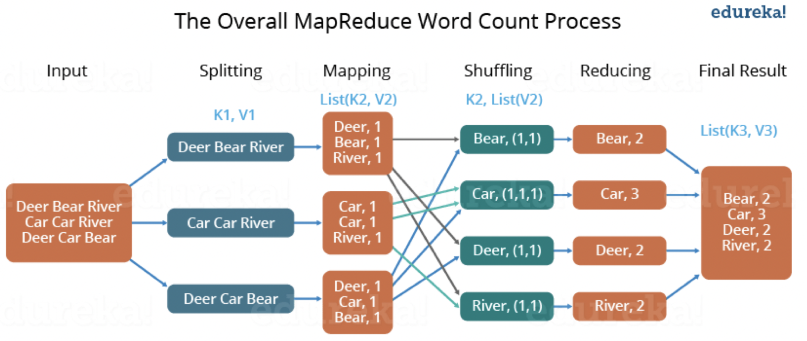
<br>

### Hadoop YARN
- Distributed data processing
- It is the Resource manager: which is also devided into *Scheduler* and *Applications manager*
- YARN also manages to swtich the *Standby Namnode* in case of failure of the Namenode. Also when both, active namenode and secondary name node fail, we have the secondary name node.

### Hadoop 3.x 
- Ensure encoding: Data is replicated 3 times, but in Hadoop version 3, parity bit encoding is used (parity block), only you need 50% more space. XOR logic
- For example you have A, B, C blocks of data. You will have AB, and BC.


## Hive: Big data SQL
**What is the Apache Hive?**
- Hive is the query interface on top of the Map Reduce. 
- It is the data warehouse.
- It has SQl style language (Hive Query Language)
- HQL translated to JAR file to be execute in cluster.
- HIVE reads data from HDFS.
- Allows creation of tables on top of the structured data.
- HIVE is not RDBMS

**Working with Hive**
- Table meta data is seperate from table
- We do NOT load the data where the HIVE tables are 
- Hive table information (meta data is saved in meta store)
- So, we keep the table structure and the data seperate  

*We are creating the table to view the already existing data from HDFS. Data should be structured. Difference between Pig and Hive is that in Hive you can query only structured data. You need to clean unstructured data before processing it in Hive. However, Pig can process both kind of data.*

**Basic commands:** [Hive Code](hive_code.txt)

**Internal vs External tables**
- There could be *internal* and *external tables* created in HIVE. The data and metadata is deleted in internal and only metadata is deleted in external tables. For Internal tables, Hive stores data into its warehouse directory.
- INTERNAL : Table is created First and Data is loaded later
- EXTERNAL : Data is present and Table is created on top of it.


## Spark: Stream and analyze the big data
*Spark* is the parallel processing framework.

**Spark architecture**
<br>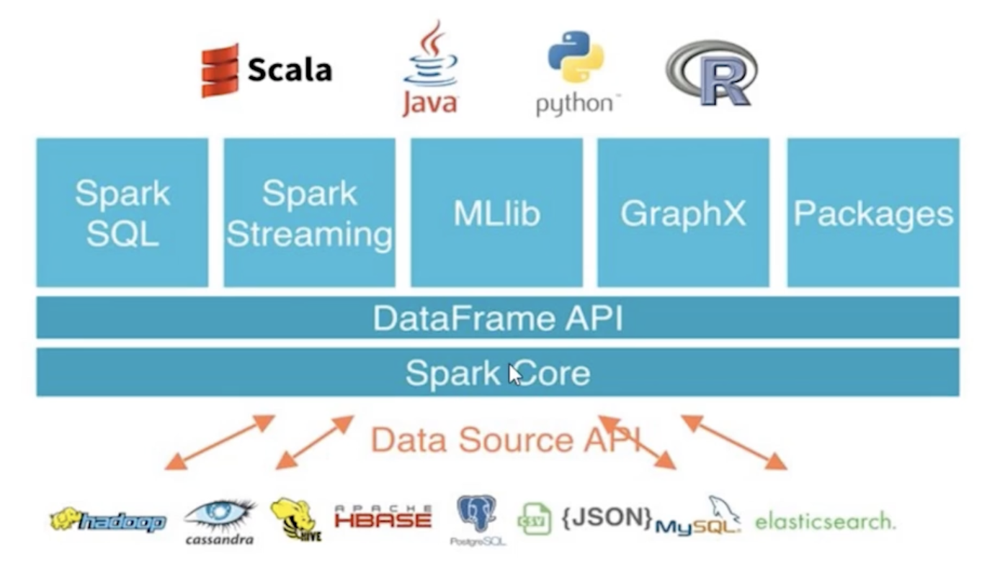
<br>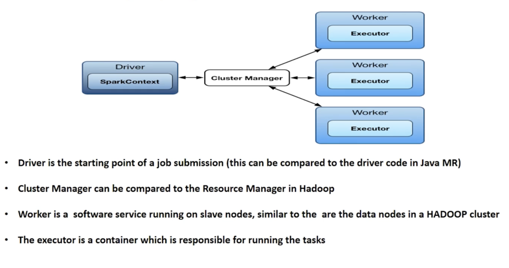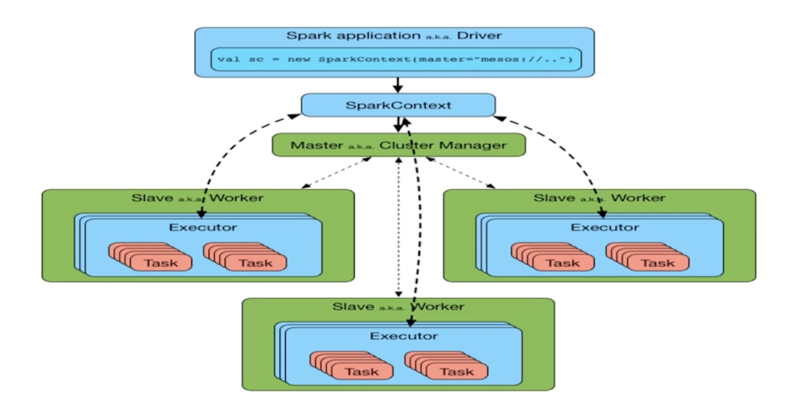

- DRIVER. The driver is the process where the main method runs. Job is launched fro Driver. First it converts the user program into tasks and after that it schedules the tasks on the executors. EXECUTORS. Executors are worker nodes' processes in charge of running individual tasks in a given Spark job. One executor may have many parts of the same job. Meaning that data on that data node, may be processed seperately. 
- *Executor* is one container for one type of job. One type of job cannot have the same executor on one machine. If someone uses Worker, new executor will be created. 

**Spark deployment modes**
- Standalone (similar to Hadoop pseudo-distributed)
- Local mode (all in one JMV)
- Server mode (fully distributed mode)

**Spark vs Hadoop**
- SPARK wins over HADOOP because:
    - Its fast because it’s an improved design over Hadoop framework
    - It uses several techniques to avoid or minimize disc I/O
    - It’s a completely in memory computing based parallel processing framework
- >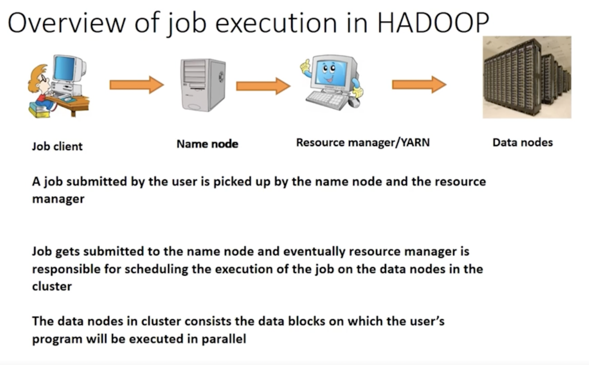

**RDDs**
- *Resilient Distributed Dataset (RDD)* is the fundamental data structure of Spark. They are immutable Distributed collections of objects of any type. As the name suggests is a Resilient (Fault-tolerant) records of data that resides on multiple nodes.
- They are **immmutable**, **partioned** and **distributed**
- The data loaded into a SPARK object is called RDD.
- 3 Basic steps for program execution: Data source --> Data loaded into spark object for manipulations --> Final result
- 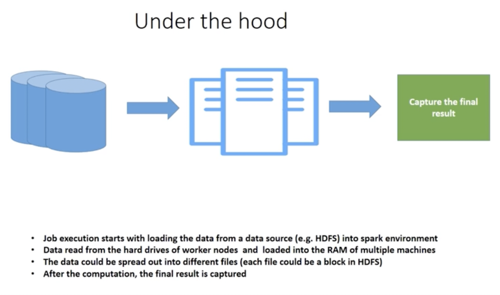
- Loading the data from hard drives to the RAM of the worker nodes is based on the data locality. Same as Hadoop, data stays on one place, only code goes there. If the data on data node, then data will be loaded on its RAM, data will not be moved. 
- 
- RDDs mostly *reside in the RAM (memory)* when the job is running.
- Spark FAIR Scheduler used by Spark for scheduling tasks. 

**Lazy evaluation**
- Laziness means not computning transformations till it's need. 
- Once action is performed, the evaluation starts. 
- It helps to reduce the number of passes. 
```
val c1 = collection.map(value => value + 1) # do not computer anything
val c2 = c1.map(value => value + 2) # don't compute
print c2 # now transform into
```
- **Type inference** is part of compile to determine the type by operatoin

**DAG optimization in Spark**
- DAGs are used here to perform step by step transformations of data.
- If there will be any error somewhere in between, as Spark saved other data in the memory, it can easily continue frmo this part.

**Caching**
- Immutable data allows you to cache data for a long time. 
- Lazy transformation allows to recreate data on failure
- Reduce I/O operations

**[Spark DataFrame basics](spark_dataframe_basics.ipynb)**

**[Music data case study]()**

### Spark streaming and Real time data analytics
**Use cases**
- Real time froud detection in credit card & banking transaction
- Digital marketing: Ads recommendation & targeting
- Social media trends analysis (Instagram, Facebook)
- Self driving cars
- IOT sensors
- HFT algorithmic trading: real time analytics on stocks and financial data

**Big companies using Big data**
- **Uber:** Uber use real time processing from billions of user's data to calculate the serge pricing in real time based on the demand. Also real time Matching prediction between customer & drivers based on ratings, and probability of cancelation. 

**Challenges while working with Streaming data**
- It requires two layers:
    - storage layer
    - processing layer
- Storage layer: it needs consistency to enable fast, inexpensive, replayable reads and writes of large stream data
- Processing layer: it is responsibe for consuming data from storage layer, processing it, and notifying storage layer to delete used data
- Scalability, data durabulity, and fault tolerance in both the storage and processig layers. 

**Stream processing in Hadoop / MR**
- In MapReduce , multiple disk I/O are involved
- Overhead in lounching new MR job is very high
- It is not having Lazy evalualtion and DAG optimization 
- It is inherently for batch processing
- High latency (lags, takes a lot of time)

**Spark streaming Architecture**
- 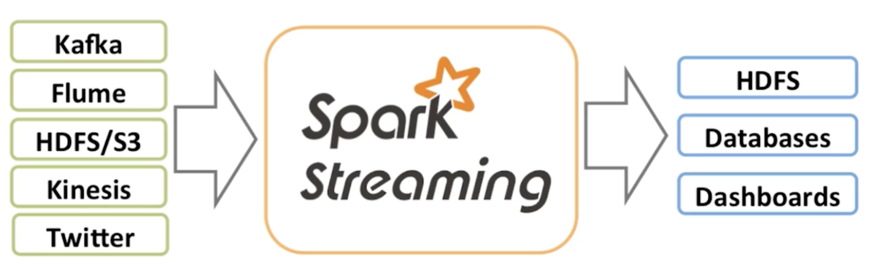
- Spark Streaming **is an extension of the core Spark API** that allows data engineers and data scientists to process real-time data from various sources including (but not limited to) Kafka, Flume, and Amazon Kinesis. This processed data can be pushed out to file systems, databases, and live dashboards.
- 
- Full architecture: you take the input data sources (streaming and static), the next step is to apply Spark SQL to analyse the data, create the features, then you clean and preprocess the data. Then you will feed your data into MLLib to predict something. Finally, you can again save your data. 
- 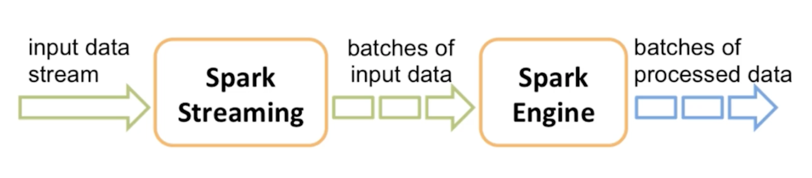
- Spark streaming divides a data stream into mini batches. It is not *pure real time analytics*, but near real time. Mini batches are **DStreams** (Discritized Stream). 
- DStream is just the continious sequence of RDDs representing a continious stream of data. Can be generated from (HDFS, Kafka, Flume)
- **Window Operation** SS offers to apply transformations over a sliding window of data.
    - *window length* = the duration of window
    - *sliding interval* = the interval in which the window operation is performed
- 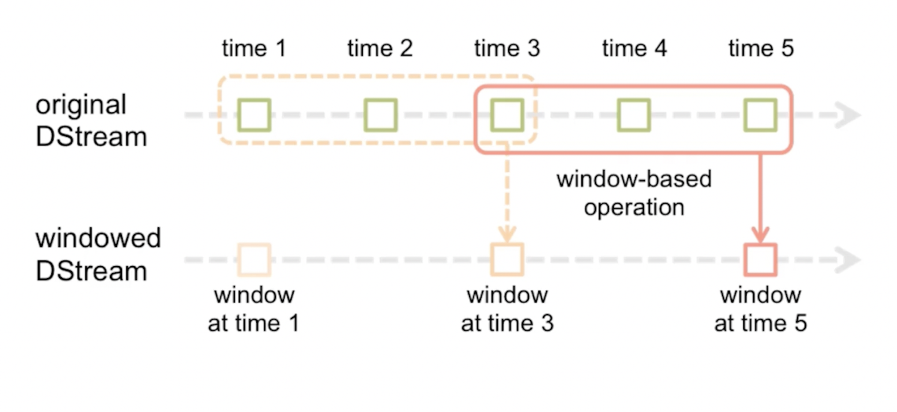
- In the image above, the operation is applied over the last 3 time units of data, also slides by 2-time units.
- **Fault tolerance** 
    - Master node (Driver), all executors will fail, all computations stopped. How to solve?
    - *Dstream checkpointing*, periodically save the DAG of Dstream to fault-tolerance storage. So when something fails, we will go to the last checkpoint, and copy all the preious information, the Driver and Executors will be restarted. `ssc.checkpoint(directory)`
    - Slave node (Executor), data on that block will be lost, and tasks restarted on block replicas. 
- Other streaming technologies:
    - Apache Storm: Pure real time streaming and processing. Can be used for fraud detection in credit card transaction. 


## Apache Kafka: Distributed Streaming Platform
- Apache Kafka is a distributed messaging system. It is used as a message broker. Depends on Zookeeper.	
- Apache Storm is a real-time message processing system.
- Kafka CANNOT process streams of records! It is just for streaming the data. Streaming happens in Apache Storm and Spark Streaming.


**Key components**
- **Broker**: nodes, manage partitions
- **Producers**: it writes tha data to Broker
- **Consumers**: it consumes the data from Broker --> topic --> partition --> offset. Generally it reads the Topic.
- **Topic**: in the same the Kafka cluster data may come from different data sources (web logs, metrics, web activities). So Topics are useful that this data (messsages) is STORED and PUBLISHED in the right place.
- **Partitions**: Kafka topics divided into Partitions. Partitions allow you to parallelize a topic by splitting the data in a particular topic across brokers. 
- **Offset**: Messages in the partition are assigned a unique and sequestion ID called Offset. You know the last number wuth offset. Partition offset is 100% fault tolerant.
- **Consumer group**: What if many confsumers want to access the same thing from topic? Then they are divided into topic. 
- **Replication**: Copying the data for preventing the data lose

**Kafka API**
- **Producer API**: stream comes, we need to *publish* it to Kafka Topic
- **Consumer API**: allows application to *subscibe* to any Kafka Topic
- **Streams API**: act as a stream processor, consuming an input stream from one or more topics, and producing an output stream to any topic.
- **Connector API**: you have external DB, and you want to replicated the DB changes to Kafka topic. It is a connector which allows to connect to traditional database. 
- 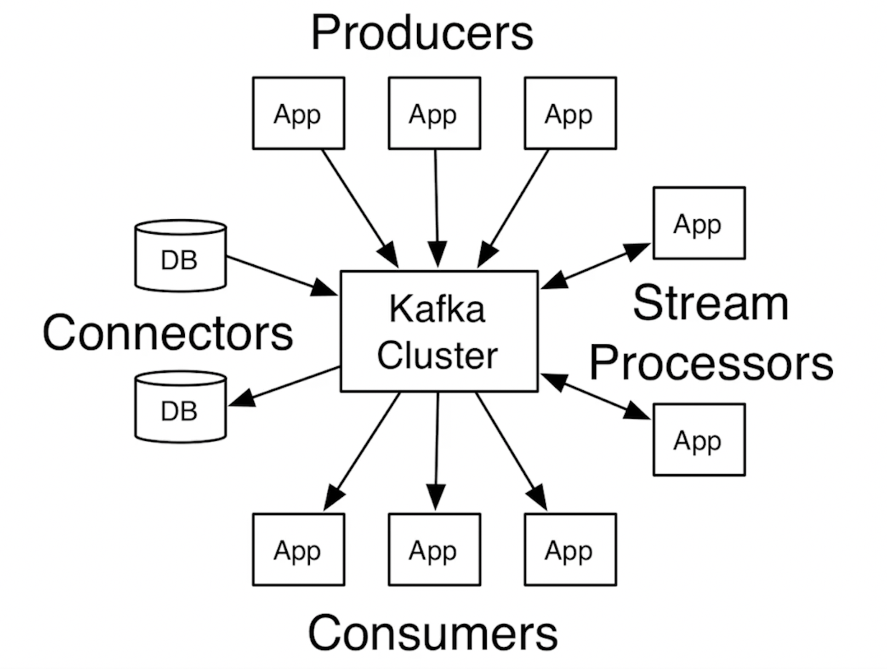

**Zookeeper**
- Used for managing and coordinating Kafka broker. 
- 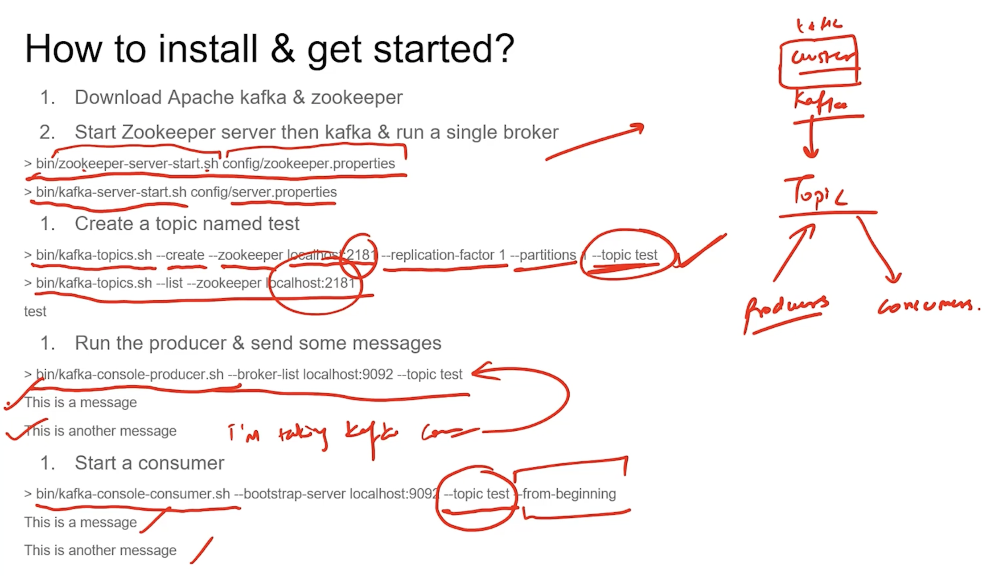

## Advanced Spark
