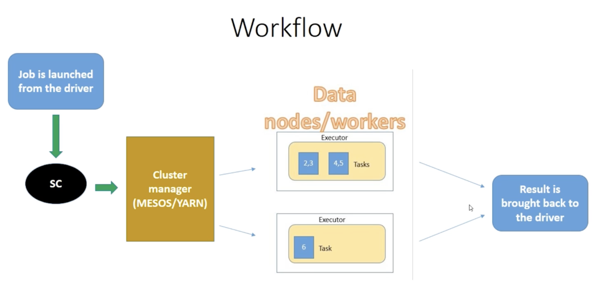
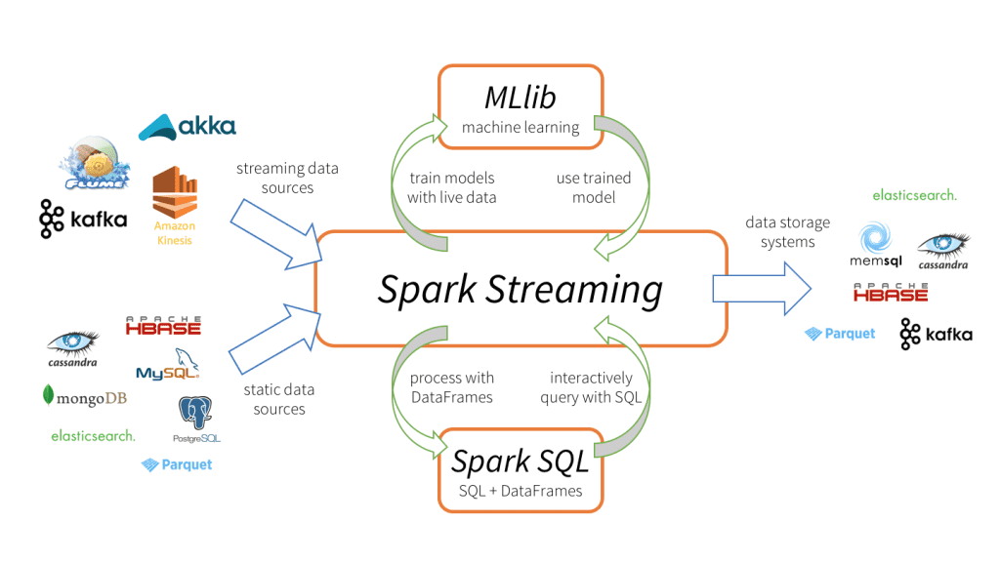

# All about Big Data 

> Here you will find general information about big data, big data tools, and big data theory.

<!-- 
Python
Java
Apache Hadoop
Apache Hadoop HDFS
Apache Hadoop YARN
Apache Spark
Apache Hadoop MapReduce
Spark Streaming
Apache Kafka
SQL 
NoSQL
Docker
Kubernetes
Linux
Networking
-->

## Table of contents:
- [Resources](#resources)
- [Big Data tools](#big-data-tools)
- [Big Data](#big-data)
- [Hadoop](#hadoop)
- [Hive: Big data SQL](#hive-big-data-sql)
- [Spark: Stream and analyze the big data](#spark-stream-and-analyze-the-big-data)
- [Kafka: Distributed Streaming Platform](#apache-kafka-distributed-streaming-platform)
- [Advanced Spark](#advanced-spark)


## Resources
- [Hadoop ecosystem explained in 20 min](https://www.youtube.com/watch?v=DCaiZq3aBSc)
- [Big Data University, cognitiveclass.ai](https://cognitiveclass.ai/learn/big-data) `Big data, Hadoop, Spark`
- [Mastering Big Data Analytics, mygreatlearning.com](https://www.mygreatlearning.com/academy/courses/2618180/10977#?utm_source=share_with_friends) `21 hours`
- https://www.javatpoint.com/hadoop-tutorial
- https://www.tutorialspoint.com/big_data_tutorials.htm
- https://www.coursera.org/learn/big-data-essentials `HDFS, MapReduce and Spark RDD`
- Articles: mckinsey.com, gartner.com


## Big Data tools


- **HDFS** = Hadoop distributes file system, stores data for many different locations, creating a centralized place to store and process the data.
- **Hadoop YARN** = Yet another resource negotiator, YARN is a resource allocator which allocates resources to run your jobs. Manages the resources on the computing cluster, knows what nodes are available, heartbeat which keeps the cluster going. YARN in a nut shell has a master (Resource Manager = job tracker) and workers (Node manager = task tracker).
- **Hadoop MapReduce**, programming model which allows us to process the data across the cluster. *Maps* transform the data in parallel across the cluster, *reducers* aggregate the data together.
- **Apache Pig** - no need to write Python, Java code, high level API with SQL-like syntaxes.
- **Apache Hive** - `SQL query` Apache Hive is a data warehouse software project built on top of Apache Hadoop for providing data query and analysis. Hive gives an SQL-like interface to query data stored in various databases and file systems that integrate with Hadoop. Used mostly to make an analysis or report. 
- **Ambari** - `Management and Monitoring`, sits on top of everything, tells info about Hadoop cluster, and visualize a cluster, how much resources I am using. Apache Ambari simplifies the management and monitoring of an Apache Hadoop cluster. 
- **Apache Spark** -  general framework for distributed computing that offers high performance for both batch and interactive processing, "alternative of MapReduce", very fast and effective, can handle SQL queries, handle streaming the data. Spark's data processing speeds are up to 100x faster than MapReduce. Because Spark processes and retains data in memory for subsequent steps. https://www.ibm.com/cloud/blog/hadoop-vs-spark

- **Apache HBase** - Apache HBase is a NoSQL key/value store which runs on top of HDFS.
- **Apache Storm** - working with the (streamed) data on real time (not a batch), data may come from sensors maybe.
- **Apache Oozie** `Work flow` Oozie is a scheduler which schedules Hadoop jobs and binds them together as one logical work. Oozie submit the job to yarn and yarn executes the job. Yarn give and manage resources to run those jobs and it does that for not only Oozie jobs but many other things. 

- **Sqoop** - `data collection` from external resources to HDFS for example. It is manually used for importing and exporting data. Specifically, it can import data from external sources into related Hadoop components like HDFS, Hbase or Hive, and export data from Hadoop to other external sources. Sqoop supports such relational databases as Oracle, Netezza and MySQL.
- **Flume** - `data collection`, web logs to cluster in real time for processing.

- **Apache Kafka** - collect data from cluster of pcs, web services and broadcast that to Hadoop cluster. Solves the problem of data ingestion.
- **Apache ZooKeeper** `Coordination` Zookeeper is used for a cluster node configuration. It is a centralized service in Hadoop, which maintains configuration information, naming as provide distributed synchronization. Additionally, it provides group services, manages and coordinates a large cluster of machines. 


## Big Data
### What is the Big Data?
- Big data a massive volume of both structured and unstructured data which is very large and complex to process using traditional database and software techniques.
- Big data is the digital trace. This digital trace is made up of all the data that is captured when we use digital technology.
- Big Data refers to the dynamic, large and disparate volumes of data being created by people, tools and machines.
It requires new, innovative, and scalable technology to collect, host and analytically process the vast amount of data gathered in order to derive real-time business insights that relate to consumers, risk, profit, performance, productivity management and enhanced shareholder value.
- [Essay: Big Data and Business Analytics comes of age](https://courses.cognitiveclass.ai/assets/courseware/v1/fe15ab4775a3befa96a1e39519d236d1/asset-v1:BigDataUniversity+BD0101EN+2016_T2+type@asset+block/Reading_1_Big_Data_and_Business_Analytics_comes_of_age_Oct_2011.pdf)
- **BD skills**: discover and analyse the trends in big data

### 5 v's of BD
- **Velocity** is the speed of the data,
or the speed at which data accumulates.
- **Volume** is the scale of the data,
or the increase in the amount of data stored.
- **Variety** is the diversity of the data. We have structured data that fits neatly into rows and columns, or relational databases and unstructured data that is not organized in a pre-defined way, for example Tweets, blog posts, pictures, numbers, and even video data.
- **Veracity** is the conformity to facts and accuracy. Quality and origin of data. Is the information real, or is it false?
- **Value** is our ability to turn the data into value (profit, social benefit, customer / employee satisfaction). The goal of BD is to derive the value from data.

### Types of data and use cases of BD
- Gigabyte -> Terabyte -> Petabyte -> Exabyte -> Zettabyte -> Yottabyte 
- Semi-structured and unstructured data can be:
    - Human generated data: blogs, reviews, emails, pictures, (Facebook, LinkedIn, Twitter)
    - Machine generated data: Internet click stream records, web server logs, IoT sensor data, images / video (video surveillance, satellite images)
    - Business generated data: 
- Why big data become popular?
    - 90% of all data created just in the last 2 years.
    - 80% of data is unstructured, so difficult to analyze.
    - Limitation in processing of in handling large structured data.
- Use cases for BD:
    - Smarter Traffic system to predict and improve traffic flow
        - Analyzed streaming real-time data gathered from cameras at entry / exit to city, GPS data from taxis and trucks, and weather information
    - Financial services
        - Detect fraud
        - Model and manage risk
        - Improve dept recovery rates
        - Personalize banking / insurance products
    - Ratail
        - In-store behavior analysis
        - Cross selling
        - Optimize pricing, placement, design
    - Social media
        - Location based marketing
        - Social segmentation
        - Sentiment analysis
        - Price comparison services
    - And many ...


## Hadoop
### Getting started: Hadoop
- **What is the Hadoop?** Apache Hadoop is a collection of open-source software utilities that facilitates using a network of many computers to solve problems involving massive amounts of data and computation. It provides a software framework for distributed storage and processing of big data using the MapReduce programming model. (Storing and processing huge amount of data)
- Specialized modules:
    - Storage, HDFS
    - Resource management and scheduling for computational tasks, YARN
    - Distributed computing, MapReduce
- **Data lake** is a vast pool of raw data, the purpose for which is not yet defined.
- **Data warehouse** is a repository for structured, filtered data that has already been processed for a specific purpose. Deliver deep insight with advance in-database analytics, OLAP.
- **Pre-processing** (irrelevant, relevant data) before moving to DW, **offloading** moving infrequently accessed data from Data Warehouses into enterprise grade Hadoop. **Exploration**, using big data capabilities to explore and discover new high value data from massive amounts
- Pros: scalability, flexibility and fault-tolerance

#### Hadoop difference
- RDBMS provides **vertical scalability**, which is also called "Scaling Up" a machine, which means you can add more resources or hardware, such as memory or CPU, to a machine in the computer cluster. While Hadoop provides **horizontal scalability**, which is known as "Scaling Out" a machine and means adding more machines to the existing computer clusters as a result of which Hadoop becomes a fault-tolerant.
    - Vertical: more CPU & Memory
    - Horizontal: more VMs - machines


### Hadoop framework: Stepping into Hadoop
- Hadoop 1.0
    - Name node, secondary name node
    - Job tracker, task tracker
    - Data nodes

**Key words (for Hadoop)**
- Commodity hardware: PCs that can be used to make a cluster
- Node: A single instance of a computer
- Rack: A collection of 40-50 nodes that are physically stored close together
- Cluster: Interconnection of systems in a network, collection of racks
- Distributed systems: A system composed to multiple autonomous computers that communicate through a computer network
- HA: high availability, ensures the availability of the Hadoop cluster without any downtime, even in unfavorable conditions like NameNode failure, DataNode failure, machine crash, etc. It means if the machine crashes, data will be *accessible from another path*.
- Hot standby: uninterrupted failover. Hot standby is normally available to the users within minutes of a disaster situation.
- Block: 128MB, the partition of big file distributed among data nodes

**Master-Slave Architecture**
- Machines in a master mode:
    - Name node, secondary name node, job tracker
- Slave nodes never transmit data without receiving a request from the master node, they wait for the signal from master. 
    - Data nodes
- Moreover, they are not connected via wifi, but via cables (optical). Together they make the cluster. 

**Deployment nodes**
- *Fully distributed mode*: each service runs on a separate hardware. Used in production. Service means (namenode, secondary namenode, job tracker, and data node).
- *Pseudo distributed mode*: All services run on the same machine but with a different JVM (testing)
- *Standalone mode*: All services run on the same machine and on the one JVM. 

**Functionality of each component**
- Master node
    - **Namenode** = central file system manager, the central piece of HDFS, client applications communicate to the NameNode at any time they need to locate a file, or when the file should be added, copied, moved or deleted. NameNode stores the metadata like a number of blocks, replicas and other details. Metadata is present in memory in the master. 
    - **Secondary namenode** = data backup of name node (not a hot standby), kind of checkpoint. The Secondary NameNode in Hadoop is a specially dedicated node in the HDFS cluster, whose main function is to take checkpoints of the file system metadata present on the NameNode. It is not a backup NameNode. It just checkpoints the NameNode's file system namespace. The Secondary NameNode is a helper to the primary NameNode but not a substitution for it. A NameNode is a single point of failure in HDFS. Thus, if the NameNode fails, the entire HDFS file system is lost. Therefore, to overcome this, Hadoop implemented Secondary NameNode, whose main function is to store a copy of the FsImage and edits log files.
    - **Job tracker**: Centralized job scheduler
- Slave nodes
    - **Data nodes**: machines where the data gets stored and processed. All big data processing happens on the data node. It can perform jobs like semantic and language analysis, statistics and machine learning tasks, and also jobs like clustering, data import, data export, search, decompression and indexing.
    - **Task tracker**: track the activities happing on the data node, and report it to job tracker. Each data node has its task tracker.
- **Note!** Every slave node keeps sending a heart beat signal to the name node once every 3 seconds to state that they are alive. What happens is when the data node goes down?

**Extra Notes**
- In *Hadoop 1.x* if a NameNode, which is a master in the cluster, goes down, the whole cluster will be not available. 
- In *Hadoop 2.0*, the HDFS High Availability feature addresses the above problem by providing an option to run two NameNodes in the same cluster in an Active/Passive configuration with a hot standby. This allows fast Failover to a new NameNode for any machine crashes or administrator-initiated fail-over for any planned maintenance activities.
- [Are Secondary NameNode and Standby node mean the same thing?](https://community.cloudera.com/t5/Support-Questions/Are-Secondary-NameNode-and-Standby-node-mean-the-same-thing/td-p/221582)
There are two different concepts. HDFS can be deployed in two modes. 1) Without HA 2) With HA.
In without HA mode, HDFS will have Namenode and Secondary Namenode. Here, secondary namenode periodically take snapshot of namenode and keep the metadata (fsimage) and audit logs up to date. So in case of Namenode failure, Secondary Namenode will have copy of latest namenode activity and prevent data loss. 
In HA mode, HDFS have two set of Namenodes. One acts as active namenode and another acts as Standby Namenode. The duties of standby namenode is similar to Secondary namenode where it keeps the track of active namenode activity and take snapshot periodically. Here, in case of active namenode failure, standby namenode automatically takes the control and becomes active. This way user will not notice the failure in namenode. This way High availability is guaranteed.
- Secondary NameNode is not required in HA configuration because the Standby node also performs the tasks of the Secondary NameNode
- **FSimage**. 
It is a file on Name Node’s Local File System, containing entire HDFS file system namespace (including mapping of blocks to files and file system properties). Details about the *location* of the data on the Data Blocks and which blocks are stored on which node.
- **Editlog**.
Transaction Log is kept on Name Node’s Local File System and stores a record/entry for *all changes* that happen in File System Metadata.
- If the number of edit logs and FSImage is big, more metadata is stored by *NameNode*. Therefore, naturally, it takes more time to start. A lot of small files also bring a communication overhead—*NameNode* handles information of more blocks, so it communicates more often with *DataNodes*.

**What is the job in Hadoop eco system?**
- A job is a *task* submitted to the cluster by the user
- A job is the form of a program or collection of programs (JAR files) which need to be executed.
- A job would have the following properties:
    - The actual program
    - Input data (collection of files)
    - Output directory

**Core software of Apache Hadoop**
- **HDFS** - data storage
- **MapReduce Framework** - once you have files, you need to process the data (parallel processing framework). 

**Submitting and executing the job in a hadoop cluster**
Hadoop cluster is the 3 masters (namenode, secondary namenode, job tracker)
<br>

### HDFS
- If you have 1GB file, and when you want to push a file to Hadoop system it will be splitted by 64MB to each block (data nodes). You have one name node, and N data nodes. 
- Name node will remember what are the host names of the data nodes, it know where the part of data is saved. 
- Breaking up of the original file happens on the client machine not in the name node.
- **What if the data node fails?** Will you lose the part of your data saved on this node? So, the data is duplicated **3** times by *Replication factor*. Yes, if you have 1PB of data, Hadoop makes in **3PB**. If the data node do not send signal to name node. Hadoop decides that the node is crushed. 
- **What if the failed node comes again?** The Over-replicated blocks are randomly removed from different nodes by the HDFS, and are rebalanced.

**Replica place strategy**
- A **Rack** is a collection nodes usually in 10 of nodes which are closely stored together and all nodes are connected to a same Switch.
- Default strategy:
    - 1st replica on the same node as client. If client is not in the cluster then the node is chosen randomly.
    - 2nd replica is placed on a node in a different (remote) rack.
    - 3rd replica on the same rack as 2nd, but different node.

**When HDFS is not good?**
- Is good for:
    - Storing TB, PB. Less number of large files and each file more than 100MB
    - Streaming data: WORM (write once read many)
- Bad for:
    - Large amount of small files. It has to do a lot of work while handling FSImages and edit logs because more files should be written. 
    -  Reading through small files involve lots of seeks and lots of hopping between data node to data node. The block in HDFS is represented as an object. Each of these objects is in the size of 150 bytes. If we consider 10 Million small files, each of these files will be using a separate block. That will cause to a use of 3 gigabytes of memory. 
    - https://data-flair.training/forums/topic/what-is-small-file-problem-in-hadoop/
    - Better for less number of large files, instead of small files 
    - Cannot edit file, only append to the end of file (from Hadoop 2.1)

**Working with HDFS**
```bash
$ cd 
$ start-all.sh             # start Hadoop services
$ jps                      # list all java processes
$ hadoop fs -ls            # list HDFS files
$ hadoop fs -ls /          # /user
$ hadoop fs -ls /user      # /user/rustam
$ hadoop fs -put sample_file.txt hdfs_folder # copying the local file to HDFS folder, if you have many nodes it will copy 3 times
$ hadoop fs -rm -skipTrash hdfs_folder/sample_file.txt
$ hadoop fs -get ... ... # copy from HDFS to local  
$
```

### Hadoop MapReduce

<br>

### Hadoop YARN
- Distributed data processing
- It is the Resource manager: which is also divided into *Scheduler* and *Applications manager*
- YARN also manages to switch the *Standby Namenode* in case of failure of the Namenode. Also when both, active namenode and secondary name node fail, we have the secondary name node.

### Hadoop 3.x 
- **Fault Tolerance:** Erasure Coding for Fault Tolerance: in Hadoop 2.x data is replicated 3 times, but in Hadoop version 3, parity bit encoding is used (parity block), only you need 50% more space. Under erasure coding, the blocks are not replicated; HDFS calculates the parity blocks for all file ones. At present, whenever the file blocks are down, Hadoop recreates through the rest blocks and parity blocks.
- For example you have A, B, C blocks of data. You will have AB, and BC.
- **Storage Overhead:** It minimizes the storage overhead of the data as Hadoop 3 adopted Erasure Coding 
    - The storage overhead in Hadoop 2.x is 200% with the default replication factor of 3.
- **DataNode Balancing:** A single DataNode manages many disks. These disks fill up evenly during a normal write operation. However, adding or replacing disks can lead to the significant skew within a DataNode. There is the HDFS balancer in Hadoop 2.x, which cannot cope with this problem.
    - New Intra-DataNode balancing from Hadoop 3 
    - set `dfs.disk.balancer.enabled` configuration to true on all DataNodes
    - The HDFS Balancer re-balances data across the DataNodes, moving blocks from over-utilized to under-utilized nodes. HDFS data might not always be distributed uniformly across DataNodes.
- **Scalability:** There is an opportunity to scale more than 10000 nodes per cluster.

### Hadoop Installations
- On-premises or cloud
- You have to consider the long-run cost, scalability and agility
- If you choose **on-premise**, it is cheaper in the long-run if properly sized and provisioned. Much more effort is required for configuration and management. The full cost of infrastructure is required upfront. It's hard to scale. You will have to buy servers which takes much time. In addition, it's less agile.
- Whereas **cloud** is more expensive in the long-run, but way cheaper upfront. It's easier to scale and less effort is required for management and support.

## Hive: Big data SQL
**What is the Apache Hive?**
- Hive is the query interface on top of the Map Reduce. 
- It is the data warehouse.
- It has SQl style language (Hive Query Language)
- HQL translated to JAR file to be execute in cluster.
- HIVE reads data from HDFS.
- Allows creation of tables on top of the structured data.
- HIVE is not RDBMS

**Working with Hive**
- Table meta data is separate from table
- We do NOT load the data where the HIVE tables are 
- Hive table information (meta data is saved in meta store)
- So, we keep the table structure and the data separate  

*We are creating the table to view the already existing data from HDFS. Data should be structured. Difference between Pig and Hive is that in Hive you can query only structured data. You need to clean unstructured data before processing it in Hive. However, Pig can process both kind of data.*

**Basic commands:** [Hive Code](hive_code.txt)

**Internal vs External tables**
- There could be *internal* and *external tables* created in HIVE. The data and metadata is deleted in internal and only metadata is deleted in external tables. For Internal tables, Hive stores data into its warehouse directory.
- INTERNAL : Table is created First and Data is loaded later
- EXTERNAL : Data is present and Table is created on top of it.


## Spark: Stream and analyze the big data
*Spark* is the parallel processing framework.

**Spark architecture**
<br>
<br>

- DRIVER. The driver is the process where the main method runs. Job is launched from Driver. First it converts the user program into tasks and after that it schedules the tasks on the executors. 
- EXECUTORS. Executors are worker nodes' processes in charge of running individual tasks in a given Spark job. One executor may have many parts of the same job. Meaning that data on that data node, may be processed separately.  *Executor* is one container for one type of job. One type of job cannot have the same executor on one machine. If someone uses Worker, new executor will be created. 

**Spark deployment modes**
- Standalone (similar to Hadoop pseudo-distributed)
- Local mode (all in one JMV)
- Server mode (fully distributed mode)

**Spark vs Hadoop**
- SPARK wins over HADOOP because:
    - Its fast because it’s an improved design over Hadoop framework
    - It uses several techniques to avoid or minimize disc I/O
    - It’s a completely in memory computing based parallel processing framework
- >

**RDDs**
- *Resilient Distributed Dataset (RDD)* is the fundamental data structure of Spark. They are immutable Distributed collections of objects of any type. As the name suggests is a Resilient (Fault-tolerant) records of data that resides on multiple nodes.
- They are **immutable**, **partitioned** and **distributed**
- The data loaded into a SPARK object is called RDD.
- Spark is a cluster computation engine, it does not replicates data or stored data implicitly. Spark processing is based on rdd, if due to node failure any of the data partition is lost it can be recalculated using DAG.
- 3 Basic steps for program execution: Data source --> Data loaded into spark object for manipulations --> Final result
- 
- Loading the data from hard drives to the RAM of the worker nodes is based on the data locality. Same as Hadoop, data stays on one place, only code goes there. If the data on data node, then data will be loaded on its RAM, data will not be moved. 
- 
- RDDs mostly *reside in the RAM (memory)* when the job is running.
- Spark FAIR Scheduler used by Spark for scheduling tasks. 

**Lazy evaluation**
- Laziness means not computing transformations till it's need. 
- Once action is performed, the evaluation starts. 
- It helps to reduce the number of passes. 
```
val c1 = collection.map(value => value + 1) # do not computer anything
val c2 = c1.map(value => value + 2) # don't compute
print c2 # now transform into
```
- **Type inference** is part of compile to determine the type by operation

**DAG optimization in Spark**
- DAGs are used here to perform step by step transformations of data.
- If there will be any error somewhere in between, as Spark saved other data in the memory, it can easily continue from this part.

**Caching**
- Immutable data allows you to cache data for a long time. 
- Lazy transformation allows to recreate data on failure
- Reduce I/O operations

**[Spark DataFrame basics](spark_dataframe_basics.ipynb)**

**[Music data case study]()**

### Spark streaming and Real time data analytics
**Use cases**
- Real time fraud detection in credit card & banking transaction
- Digital marketing: Ads recommendation & targeting
- Social media trends analysis (Instagram, Facebook)
- Self driving cars
- IOT sensors
- HFT algorithmic trading: real time analytics on stocks and financial data

**Big companies using Big data**
- **Uber:** Uber use real time processing from billions of user's data to calculate the serge pricing in real time based on the demand. Also real time Matching prediction between customer & drivers based on ratings, and probability of cancellation. 

**Challenges while working with Streaming data**
- It requires two layers:
    - storage layer
    - processing layer
- Storage layer: it needs consistency to enable fast, inexpensive, repayable reads and writes of large stream data
- Processing layer: it is responsible for consuming data from storage layer, processing it, and notifying storage layer to delete used data
- Scalability, data durability, and fault tolerance in both the storage and processing layers. 

**Stream processing in Hadoop / MR**
- In MapReduce , multiple disk I/O are involved
- Overhead in launching new MR job is very high
- It is not having Lazy evaluation and DAG optimization 
- It is inherently for batch processing
- High latency (lags, takes a lot of time)

**Spark streaming Architecture**
- 
- Spark Streaming **is an extension of the core Spark API** that allows data engineers and data scientists to process real-time data from various sources including (but not limited to) Kafka, Flume, and Amazon Kinesis. This processed data can be pushed out to file systems, databases, and live dashboards.
- 
- Full architecture: you take the input data sources (streaming and static), the next step is to apply Spark SQL to analyse the data, create the features, then you clean and preprocess the data. Then you will feed your data into MLLib to predict something. Finally, you can again save your data. 
- 
- Spark streaming divides a data stream into mini batches. It is not *pure real time analytics*, but near real time. Mini batches are **DStreams** (Discritized Stream). 
- DStream is just the continuous sequence of RDDs representing a continuous stream of data. Can be generated from (HDFS, Kafka, Flume)
- **Window Operation** SS offers to apply transformations over a sliding window of data.
    - *window length* = the duration of window
    - *sliding interval* = the interval in which the window operation is performed
- 
- In the image above, the operation is applied over the last 3 time units of data, also slides by 2-time units.
- **Fault tolerance** 
    - Master node (Driver), all executors will fail, all computations stopped. How to solve?
    - *Dstream checkpointing*, periodically save the DAG of Dstream to fault-tolerance storage. So when something fails, we will go to the last checkpoint, and copy all the previous information, the Driver and Executors will be restarted. `ssc.checkpoint(directory)`
    - Slave node (Executor), data on that block will be lost, and tasks restarted on block replicas. 
- Other streaming technologies:
    - Apache Storm: Pure real time streaming and processing. Can be used for fraud detection in credit card transaction. 


## Apache Kafka: Distributed Streaming Platform
- Apache Kafka is a distributed messaging system. It is used as a message broker. Depends on Zookeeper.	
- Apache Storm is a real-time message processing system.
- Kafka CANNOT process streams of records! It is just for streaming the data. Streaming happens in Apache Storm and Spark Streaming.
- https://stackoverflow.com/questions/21808529/apache-kafka-vs-apache-storm

**Key components**
- **Broker**: nodes, manage partitions
- **Producers**: it writes tha data to Broker
- **Consumers**: it consumes the data from Broker --> topic --> partition --> offset. Generally it reads the Topic.
- **Topic**: in the same the Kafka cluster data may come from different data sources (web logs, metrics, web activities). So Topics are useful that this data (messages) is STORED and PUBLISHED in the right place.
- **Partitions**: Kafka topics divided into Partitions. Partitions allow you to parallelize a topic by splitting the data in a particular topic across brokers. 
- **Offset**: Messages in the partition are assigned a unique and sequential ID called Offset. You know the last number with offset. Partition offset is 100% fault tolerant.
- **Consumer group**: What if many consumers want to access the same thing from topic? Then they are divided into topic. 
- **Replication**: Copying the data for preventing the data lose

**Kafka API**
- **Producer API**: stream comes, we need to *publish* it to Kafka Topic
- **Consumer API**: allows application to *subscibe* to any Kafka Topic
- **Streams API**: act as a stream processor, consuming an input stream from one or more topics, and producing an output stream to any topic.
- **Connector API**: you have external DB, and you want to replicated the DB changes to Kafka topic. It is a connector which allows to connect to traditional database. 
- 

**Zookeeper**
- Used for managing and coordinating Kafka broker. 
- 


## Advanced Spark
- Spark properties / configuration
    - Spark properties `SparkConf`
    - Environment variables (what is the master node, slave node, IP address, host name), `conf/spark-env.sh`
    - Logging `log4j.properties`
- Performance tuning
- Job scheduling

**Spark Properties**
```
# By setting in the code
val conf = new SparkConf().setMaster("local[2]").setAppName("CountingSheep")
val sc = new SparkContest(conf)
```
```
# Dynamically loading Spark Properties
val sc = new SparkContest(new SparkConf())

# Then you can supply configuration online:
./bin/spark-submit --name "My app" --master local[4] --conf spark.eventLog.enables=false --conf "spark.executor.extraJavaOptions=-XX: +PrintGCDetails -XX: +PrintGCTimeStamp" myApp.jar
```
```
# conf/spark-defaults.conf

spark.master            spark://5.6.7.8:7077
spark.executor.memory   4g
spark.eventLog.enabled  true
spark.serializer        org.apache.spark.serializer.KryoSerializer
```

**Environment variables**
- `conf/spark-env.sh`
```
JAVA_HOME
PYSPARK_PYTHON
PYSPARK_DRIVER_PYTHON
...
SPARK_LOCAL_IP
SPARK_PUBLIC_DBS
```

**Configuring logging**
- *log4j* used for logging
- Add `log4j.properties` file in the conf file (template located there if needed)
- Overriding configuration directory "SPARK_HOME/conf", we can set "SPARK_CONF_DIR"
- **Configuring HADOOP Cluster configurations**
    - `hdfs-site.xml`, provide default behaviors for the HDFS client
    - `core-site.xml`, which sets the default filesystem name
    - common location is `/etc/hadoop/conf`
    - to make these files visible to Spark, need to set HADOOP_CONF_DIR to $SPARK_HOME/conf/spark-env.sh pointing to the location of these files

**Performance tuning**
- **Data serialization**
    - Less memory, faster operations
    - `conf.set("spark.serializer", "org.apache.spark.serializer.KryoSerializer")
- **Memory tuning**
    - the amount of memory used by your objects
    - the cost of accessing these objects
    - !Note: Java takes 2-5x more space than the "raw" data inside their field. 
    - **Memory management**
        - Execution = memory used for computation in shuffles, joins, sorts, aggregations.
        - Storage = storage memory refers to that used for caching and propagating internal data across cluster.
        - M: execution & storage place, `spark.memory.fraction`
        - R: cached blocks never, `spark.memory.storageFraction`

**Garbage collections**
- Memory blocks in the memory, but never used
- Ex.: In each step when we do smth over RDD we create new RDD, because they are immutable. When we do any aggregation, count, sum. 
- Java Heap: Young and Old
    - Young: Eden, Survivor1, Survivor2
    - When Eden is full, minor GC is running and objects that are alive from Eden to Survivor1 then copied to Survivor2 (by swapping survivors)
    - When Survivor2 is old enough, it is moved to Old.
    - Finally when Old is full, then full GC invoked.

*When you have out of memory error, then increase the level of parallelism. `spark.default.parallelism`*

**Job scheduling**
- Give the max number of resources the application is able to use!
- **Modes in cluster management:**
    - Standalone mode:
        - FIFO (first in first out), queue
        - Each application will try to use all available nodes
        - Static resource sharing is used. You will set before hand, how much nodes (CPU) and Memory to use.
        - Can limit the number of nodes by `spark.cores.max`, `spark.executor.memory`
    - Mesos:
        - Dynamic resource sharing. Depending on usage of application, Mesos will give more or less number of resources. 
        - set `spark.dynamiAllocation.enabled` to true
    - YARN:
        - You can specify how many executors you want, and how much memory and core for each executor (executor=process inside node responsible to run tasks of the same job).


## More:
- Small file problem in Hadoop: https://data-flair.training/forums/topic/what-is-small-file-problem-in-hadoop/

- **Parallel computing vs distributed computing.** The main difference between parallel and distributed computing is that parallel computing allows multiple processors to execute tasks simultaneously while distributed computing divides a single task between multiple computers to achieve a common goal. 
    - https://pediaa.com/what-is-the-difference-between-parallel-and-distributed-computing/
    - https://medium.com/@arunaraj2468/how-is-hadoop-different-from-other-parallel-computing-systems-2a11a5ede574
    - https://www.geeksforgeeks.org/difference-between-parallel-computing-and-distributed-computing/

- https://blog.cloudera.com/how-to-tune-your-apache-spark-jobs-part-1/
