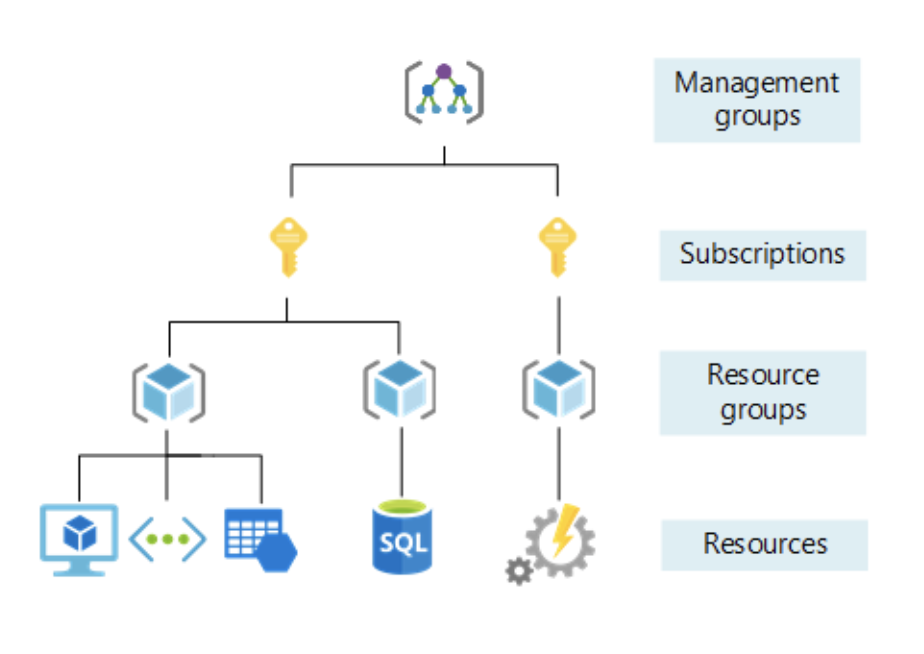

# Microsoft Azure

    High availability, scalability, elasticity, agility, and disaster recover
    Azure architecture components such as subscriptions, management groups, resources and resource groups
    Geographic distribution concepts such as Azure regions, region pairs, and availability zones

- https://docs.microsoft.com/en-us/learn/paths/az-900-describe-cloud-concepts/
- https://docs.microsoft.com/en-us/learn/paths/azure-for-the-data-engineer/

### Core Azure concepts
- https://youtu.be/RWgW-CgdIk0
- https://docs.microsoft.com/en-us/learn/modules/intro-to-azure-fundamentals/tour-of-azure-services
- https://docs.microsoft.com/en-us/learn/modules/fundamental-azure-concepts/categories-of-cloud-services

- **High availability**: Depending on the service-level agreement (SLA) that you choose, your cloud-based apps can provide a continuous user experience with no apparent downtime, even when things go wrong.

- **Scalability**: Apps in the cloud can scale vertically and horizontally:
 - Scale vertically to increase compute capacity by adding RAM or CPUs to a virtual machine.
 - Scaling horizontally increases compute capacity by adding instances of resources, such as adding VMs to the configuration.

- **Elasticity**: You can configure cloud-based apps to take advantage of autoscaling, so your apps always have the resources they need

- **Agility**: Deploy and configure cloud-based resources quickly as your app requirements change.

- **Geo-distribution**: You can deploy apps and data to regional datacenters around the globe, thereby ensuring that your customers always have the best performance in their region.

- **Disaster recovery**: By taking advantage of cloud-based backup services, data replication, and geo-distribution, you can deploy your apps with the confidence that comes from knowing that your data is safe in the event of disaster.

- Cloud service models:
    - Infrastructure-as-a-Service (IaaS) - is the most flexible cloud service because you have control to configure and manage the hardware running your application.. Good for rapid deployment of new compute devices.
    - Platform-as-a-Service (PaaS) - cloud provider manages virtual machines and networking resources. Here developers can upload their web applications, without having to worry about the physical hardware and software requirements. *Azure App Services*
    - Software-as-a-Service (SaaS) - cloud provider manages all aspects of the application environment, such as virtual machines, networking resources, data storage, and applications. *Microsoft Office 365*

- 

## Azure services
    Azure Virtual Machines
    Azure App Service
    Azure Container Instances
    Azure Kubernetes Service
    Azure Functions
    Azure Virtual Desktop

