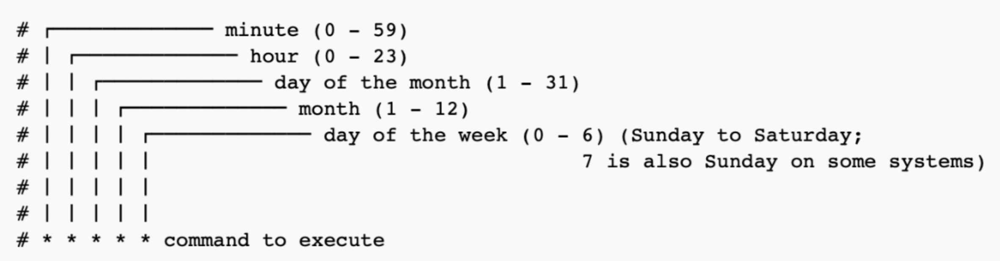

## Introduction to Airflow
```py
from airflow.models import DAG 
from airflow.operators.bash_operator import BashOperator
from airflow.operators.python_operator import PythonOperator
from datetime import datetime

default_arguments = {'owner': 'rustam_z',
                    'email': 'jdoe@datacamp.com', 
                    'email_on_failure': True,
                    'email_on_success': True
                    'start_date': datetime(2020, 1, 20), # also end_data
                    'retries': 3, # number of tries before fail
                    'sla': timedelta(minutes=30), # sends email if the DAG execution exceeds time 
                     }

# schedule_interval must be start_date + schedule_interval, bacause when start_date DAG do not run
example_dag = DAG(dag_id='etl_workflow', default_args=default_arguments, 'schedule_interval': @daily) # DAG = Directed acyclic graph

# airflow list_dags
# airflow webserver -p 9090
# airflow scheduler
# airflow run <dag_id> <task_id> <start_date>

'''Airflow operators: BashOperator, PythonOperator'''
task1 = BashOperator(task_id='first_task',
    bash_command='runcleanup.sh', # may put any bash script
                     dag=example_dag)

task2 = BashOperator(task_id='second_task',
                     bash_command='echo 2',
                     dag=example_dag)

task3 = BashOperator(task_id='third_task',
                     bash_command='echo 3',
                     dag=example_dag)

'''Upstream and downstream tasks
`task1 >> task2` upstream, meaning to run **task1** to run before **task2**

`task2 >> task1` downstream, meaning to run task1 to run after task2
'''
task1>>task2
task3<<task2

def pull_file(URL, savepath):
    r = requests.get(URL)
    with open(savepath, 'wb') as f:
        f.write(r.content)    
    # Use the print method for logging
    print(f"File pulled from {URL} and saved to {savepath}")
    
# Create the task
pull_file_task = PythonOperator(
    task_id='pull_file',
    python_callable=pull_file,
    # Define the arguments
    op_kwargs={'URL':'http://dataserver/sales.json', 'savepath':'latestsales.json'},
    dag=process_sales_dag # just imagine it is another DAG
)

# Define the email task
email_report = EmailOperator(
        task_id='email_report',
        to='airflow@datacamp.com',
        subject='Airflow Monthly Report',
        html_content="""Attached is your monthly workflow report - please refer to it for more detail""",
        files=["monthly_report.pdf"],
        dag=process_sales_dag
)

email_report << pull_file_task
```

**CRON**



Preset | cron equivalent
-------|--------------
@hourly | 0 * * * *
@daily | 0 0 * * *
@weekly | 0 0 * * 0
@monthly | 0 0 1 * *
@yearly | 0 0 0 1 *
None | don't schedule, one will run manually
@once | just one time

```shell
$ man crontab
$ crontab -l
$ # * * * * * means every minute of every hour of every day of every month and of every day of week
$ echo "* * * * * python hello_world.py" | crontab
$ # 5 1 * * * run every day at 1:05 am
$ # 15 14 * * 0 run at 2:15pm every Sunday
$ # */15 * * * * every 15 minute
$ # 15,30,45 * * * * at the 15, 30 and 45 minutes
```

```py
"""Sensors"""
from airflow.models import DAG
from airflow.operators.bash_operator import BashOperator
from airflow.contrib.sensors.file_sensor import FileSensor
from datetime import datetime

default_args={
    'email': ["airflowalerts@datacamp.com", "airflowadmin@datacamp.com" ],
    'email_on_failure': True,
    'email_on_success': True
}
report_dag = DAG(
    dag_id = 'execute_report',
    schedule_interval = "0 0 * * *",
    default_args=default_args
)

precheck = FileSensor(
    task_id='check_for_datafile',
    filepath='salesdata_ready.csv',
    start_date=datetime(2020,2,20),
    mode='reschedule',
    poke_interval=45,
    dag=report_dag)

generate_report_task = BashOperator(
    task_id='generate_report',
    bash_command='generate_report.sh',
    start_date=datetime(2020,2,20),
    dag=report_dag
)

precheck >> generate_report_task
```

```py
"""Templates"""
from airflow.models import DAG
from airflow.operators.bash_operator import BashOperator
from datetime import datetime

default_args = {
  'start_date': datetime(2020, 4, 15),
}

cleandata_dag = DAG('cleandata',
                    default_args=default_args,
                    schedule_interval='@daily')

# Modify the templated command to handle a
# second argument called filename.
templated_command = """
  bash cleandata.sh {{ ds_nodash }} {{ params.filename }}
"""

# Modify clean_task to pass the new argument
clean_task = BashOperator(task_id='cleandata_task',
                          bash_command=templated_command,
                          params={'filename': "salesdata.txt"},
                          dag=cleandata_dag)

# Create a new BashOperator clean_task2
clean_task2 = BashOperator(task_id='cleandata_task2',
                          bash_command=templated_command,
                          params={'filename': "supportdata.txt"},
                          dag=cleandata_dag)
                           
# Set the operator dependencies
clean_task2 << clean_task
```
```py
"""Branching"""
# Create a function to determine if years are different
def year_check(**kwargs):
    current_year = int(kwargs['ds_nodash'][0:4])
    previous_year = int(kwargs['prev_ds_nodash'][0:4])
    if current_year == previous_year:
        return 'current_year_task'
    else:
        return 'new_year_task'

# Define the BranchPythonOperator
branch_task = BranchPythonOperator(task_id='branch_task', dag=branch_dag,
                                   python_callable=year_check, provide_context=True)
# Define the dependencies
branch_dag >> current_year_task
branch_dag >> new_year_task
```

```py
"""Complete example"""
from airflow.models import DAG
from airflow.contrib.sensors.file_sensor import FileSensor
from airflow.operators.bash_operator import BashOperator
from airflow.operators.python_operator import PythonOperator
from airflow.operators.python_operator import BranchPythonOperator
from airflow.operators.dummy_operator import DummyOperator
from airflow.operators.email_operator import EmailOperator
from dags.process import process_data
from datetime import datetime, timedelta

# Update the default arguments and apply them to the DAG.

default_args = {
  'start_date': datetime(2019,1,1),
  'sla': timedelta(minutes=90)
}
    
dag = DAG(dag_id='etl_update', default_args=default_args)

sensor = FileSensor(task_id='sense_file', 
                    filepath='/home/repl/workspace/startprocess.txt',
                    poke_interval=45,
                    dag=dag)

bash_task = BashOperator(task_id='cleanup_tempfiles', 
                         bash_command='rm -f /home/repl/*.tmp',
                         dag=dag)

python_task = PythonOperator(task_id='run_processing', 
                             python_callable=process_data,
                             provide_context=True,
                             dag=dag)


email_subject="""
  Email report for {{ params.department }} on {{ ds_nodash }}
"""


email_report_task = EmailOperator(task_id='email_report_task',
                                  to='sales@mycompany.com',
                                  subject=email_subject,
                                  html_content='',
                                  params={'department': 'Data subscription services'},
                                  dag=dag)


no_email_task = DummyOperator(task_id='no_email_task', dag=dag)


def check_weekend(**kwargs):
    dt = datetime.strptime(kwargs['execution_date'],"%Y-%m-%d")
    # If dt.weekday() is 0-4, it's Monday - Friday. If 5 or 6, it's Sat / Sun.
    if (dt.weekday() < 5):
        return 'email_report_task'
    else:
        return 'no_email_task'
    
    
branch_task = BranchPythonOperator(task_id='check_if_weekend',
                                   python_callable=check_weekend,
                                   provide_context=True,
                                   dag=dag)

    
sensor >> bash_task >> python_task

python_task >> branch_task >> [email_report_task, no_email_task]

```