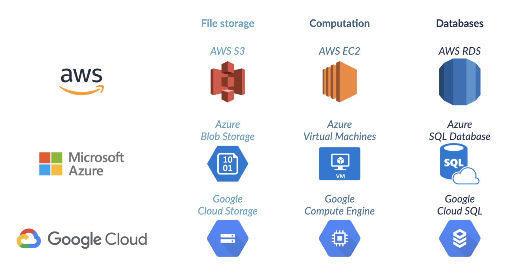

# All about data engineering 
*Learn, Practice, Apply*

## Data engineering for everyone

**Data workflow**
- Data Collection & Storage
- Data Preperation
- Exploration & Visualization
- Experimentation & Prediction

**Data engineer deliver:**
- the correct data
- in the right form
- to the right people
- as efficiently as possible

The main objective, when setting up **data pipelines**, is to improve the efficiency with which data flows, from its ingestion to the final users.

Data engineers use parallel and cloud computing to keep pipelines flowing smoothly.

ETL           | Data pipelines
------------- | -------------
Framework for designing data pipelines  | Move data from one system to another
**Extract** data  | May follow ETL
**Transform** extracted data | Data may not be transformed
**Load** transformed data to another databse | Data may be directly loaded in applications

**A data lake** - all data from all data sources,
**a data warehouse** - part of data from data lake used for analysis. Type of database.

**Processing data** - converting raw data into meaningful information. Most of the data processing steps are *transformation* steps including selecting, encoding, calculating new values, sorting and ordering, joining data from multiple sources, aggregating, pivoting tables, splitting one table into several ones, removing duplicate values.

**Schedules**

**Manual** | **Time** | **Condition (Sensor)**
-----------|----------|-----------
Manually update the employee table. | Update at 6 AM everyday. | Update departments table when the new employee was added.

Batches (records are grouped and processed at intervals) or streams (records are sent individually right away).

**Batch** | **Stream** 
-----------|----------
Adding new employee to a table. | Updating the count of followers when user subscribes to it.
Reducing access to premium features when someone unsubscribe. | When user listening to music Apple Watch and downwards the song.

**Cloud computing**

So we use S3 to store cover albums, EC2 to process songs, and RDS to store employees information.

