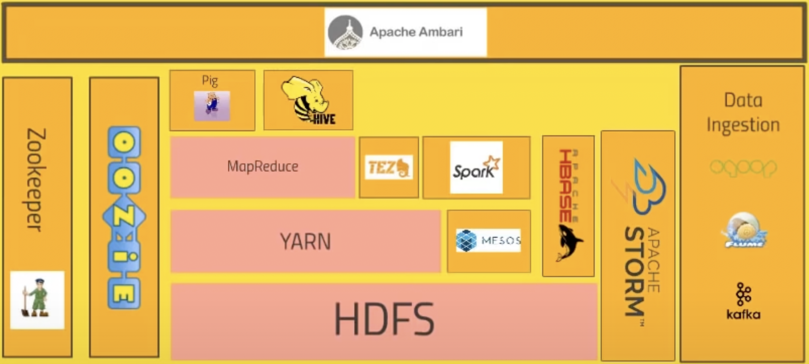
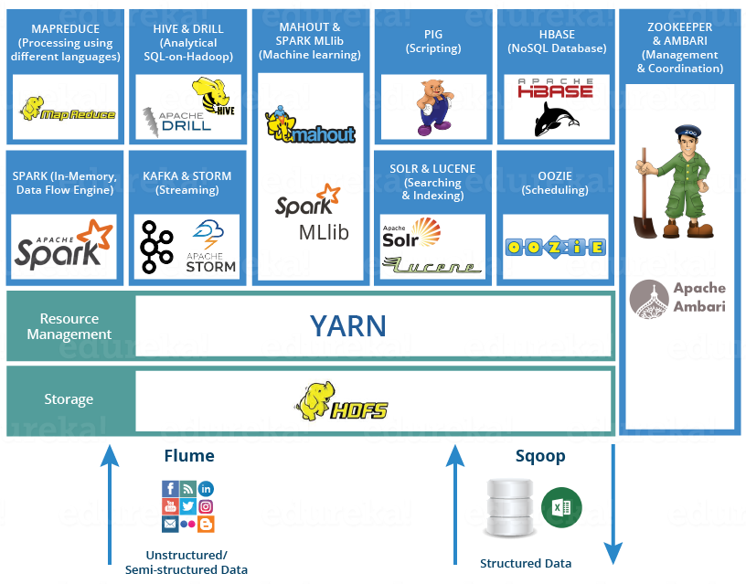

# Big Data 

    Tools: 
    Python
    Java
    Apache Hadoop
    Apache Hadoop HDFS
    Apache Hadoop YARN
    Apache Spark
    Apache Hadoop MapReduce
    Spark Streaming
    Apache Kafka
    SQL

## How to learn:
- https://www.youtube.com/watch?v=DCaiZq3aBSc Hadoop
- https://cognitiveclass.ai/learn/big-data Big data, Hadoop, Spark 
- https://www.mygreatlearning.com/academy/courses/2618180/10977#?utm_source=share_with_friends Also interesting 21 hours of video
- https://www.tutorialspoint.com/big_data_tutorials.htm Tutorialspoint Big Data
- https://learn.datacamp.com/skill-tracks/big-data-with-pyspark PySpark
- https://www.coursera.org/learn/big-data-essentials HDFS, MapReduce and Spark RDD 

## World of Hadoop
1. Query engine
2. Core Hadoop ecosystem
3. Enternal Data Storage
    - MySQL, MongoDB, Cassandra

### **Core Hadoop ecosystem**
- **HDFS** = Hadoop distributes file system, data storage (distributed) part of Hadoop.
- **YARN** = Yet another resource negotiator, data processing part of Hadoop, manages the resources on the computing cluster, decides what tasks to run and when, what nodes are available, heartbeat which keeps the cluster going.
- **MapReduce**, programming model which allows us to process the data across the cluster. *Maps* transform the data in parallel across the cluster, *reducers* aggregate the data together.
- **Pig** - no need to write Python, Java code, high level API with SQL-like syntasis.
- **Hive** - Apache Hive is a data warehouse software project built on top of Apache Hadoop for providing data query and analysis. Hive gives an SQL-like interface to query data stored in various databases and file systems that integrate with Hadoop. Used mostly to make an analysis or report. 
- **Apmari** - sits on top of everything, tell info about cluster, and visualize a cluster, how much resources I am using. 
- **Spark** - alternative of MapReduce, very fast and effective, can handle SQL queries, handle streaming the data. Spark's data processing speeds are up to 100x faster than MapReduce. Because Spark processes and retains data in memory for subsequent steps.
- **HBase** - Apache HBase is a NoSQL key/value store which runs on top of HDFS.
- **Apache Storm** - working with the (streamed) data on real time (not a batch), data may come from sensors maybe.
- **OOZIE** - workflow scheduling system to manage Hadoop jobs, automation of steps.  
- **Scoop** - data ingestion from external resources to HDFS for example. A connector between Hadoop and legacy data systems.
- **Flume** - web logs to cluster in real time for processing.
- **Kafka** - collect data from cluster of pcs, web services and broadcast that to Hadoop cluster. Solves the problem of data ingestion.

# [Mastering Big Data Analytics](https://olympus.greatlearning.in/courses/10977/pages/big-data-touch) by Great Learning

- Hadoop: Master your Big Data
- Hive: Big data SQL
- Spark: Stream and analyze the big data
- Apache Kafka: Distributed Streaming Platform
- Advanced Spark

## Hadoop: Master your Big Data

## Hive: Big data SQL

## Spark: Stream and analyze the big data

## Apache Kafka: Distributed Streaming Platform

## Advanced Spark